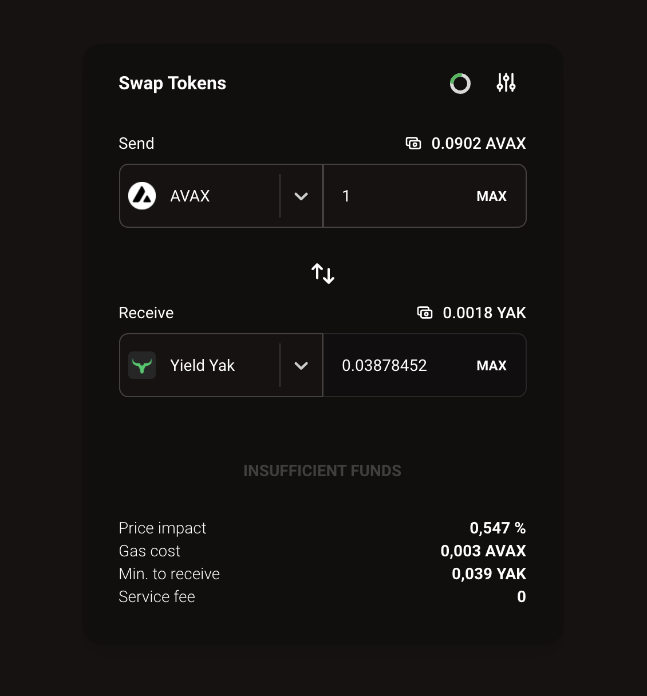

# `🐃 @yak-spirit/yak-swap-ui`

[](https://www.gnu.org/licenses/gpl-3.0)

A reusable React component for swapping with Yield Yak Router. The YY Router can be
found [here](https://github.com/yieldyak/yak-aggregator).

[npm component](https://www.npmjs.com/package/@yak-spirit/yak-swap-ui)

Usage example:
[Yak Spirit](https://github.com/dragoonzx/yak-spirit)



# Usage

You can use swap as iframe or as React component:

#### Iframe

Just insert this iframe

```html
<iframe width="400" height="525" src="https://yak-swap-ui-example.vercel.app/"></iframe>
```

example https://codesandbox.io/s/xenodochial-shtern-neh7b?file=/index.html

#### React component

First install the required peer dependencies into your React project.

```
yarn add web3 bignumber.js react-use react-countdown-circle-timer valtio react-number-format @headlessui/react classnames react-windowed-select react-moralis moralis daisyui eth-permit react-toastify
```

Wrap your app in MoralisProvider, provide appId & serverId (server should support Avalanche Mainnet)
You can find instructions here: https://github.com/MoralisWeb3/react-moralis

Install tailwind (use as guidance https://tailwindcss.com/docs/guides/create-react-app)

```
yarn add -D tailwindcss postcss autoprefixer
npx tailwindcss init -p
```

Configure tailwind.config.js (example configuration in yak-spirit repo)
You need something like './node_modules/@yak-spirit/yak-swap-ui/\*\*/\*.js' in tailwind.config content array
Add tailwind directives to your CSS and import .css file

And import toastify styles

```javascript
import 'react-toastify/dist/ReactToastify.css';
```

⚠️ if you have webpack >= 5 or cra >= 5, you should do some manipulations to include node-compatible dependencies. Check examples.

Then install the package.

```
yarn add @dragoonzx/yak-swap-ui
```

#### Add the Swap Component

To embed the `YakSwap` component into your application,
you should do all prerequisite installation
and then you can just use component
For example,

```javascript
import YakSwap from '@yak-spirit/yak-swap-ui';

<YakSwap />;
```

All of the complexity of communicating with the YY Router and managing
its data is handled internally by the component.

#### Referral Fees

To earn referral fees ...

# Developing

#### Install dependencies

```
yarn
```

#### Build

```
yarn build
```

## Run the example app

```
yarn dev
```

# Contributing

Interested in contributing to the Yak Spirit or Yak Swap UI? Thanks so much for your interest! We are always looking for improvements to the project and contributions from open-source developers are greatly appreciated.

If you have a contribution in mind, please open issue or PR with your ideas.

# Licence

Yak Spirit & Yak Swap UI is [GNU-3 licensed](https://github.com/dragoonzx/yak-spirit/blob/main/LICENSE)

<p align="center">
  
</p>
